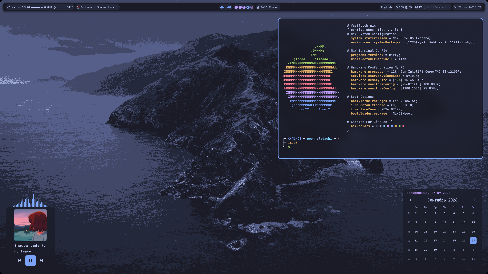
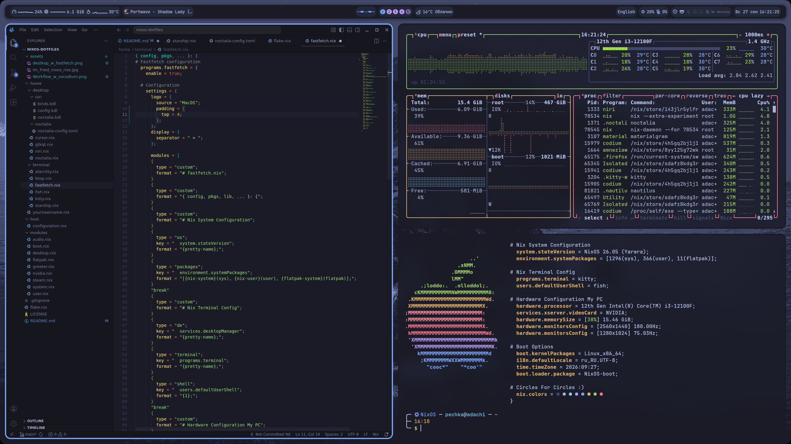
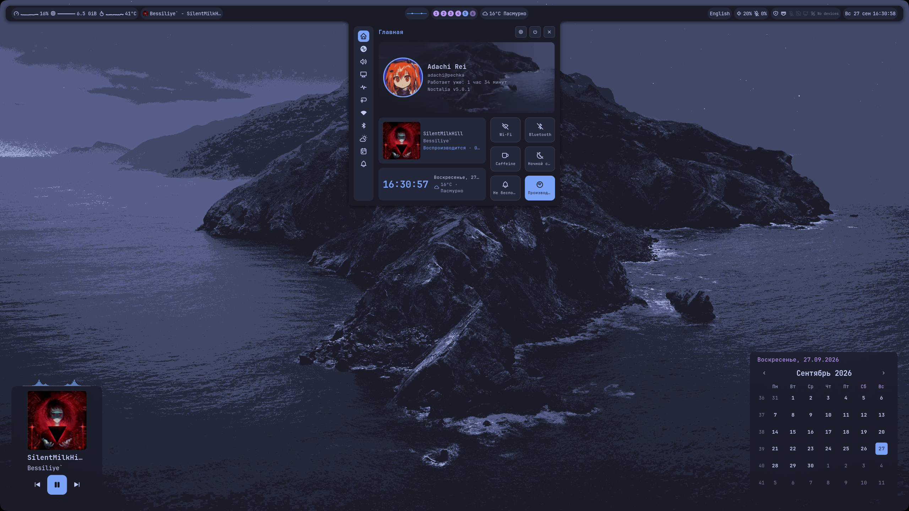
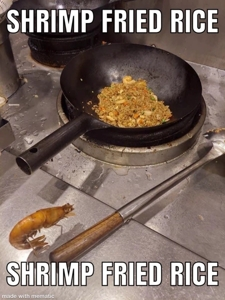

# Krevedka`s dotfiles
This is my NixOS and Home Manager rice with Noctalia Shell on Niri with Tokyo Night color theme.

## Short overview

### Terminal
Main terminal - **Kitty**, also, you can change them to **Alacritty**. Main terminal shell: **Fish** w/**Starship**. Also, I made custom .NixConfig-style **Fastfetch**. Soon, I`m made other terminal shells (**zhs, bash,** etc.) with custom featuers.

### Niri and Noctalia
**Niri** have custom binds and deep integration w/**Noctalia v5**. Custom **Noctalia** statusbar have a resource monitor and other features. Some **Niri** keybinds can starting programs (**Prism, OBS, Obsidian, Btop,** etc.).

### Main Niri binds
You can find all **Niri/Noctalia** binds in `home/desktop/niri/binds.kdl`.

```
- Niri features-
Mod+Shift+Slash "/" - Toggle cheatsheet (Useless)
Mod+Shift+E - Exit from Niri

- Window management -
Mod+Q - Close window
Mod+R - Change window proportion
Mod+F - Expand window to proportion 1
Mod+Tab - Open window overview
Mod+Shift+F - Toggle window to fullscreen
Mod+Shift+T - Window floating

- Programs -
Mod+Return - ${terminal} (kitty/alacritty)
Mod+W - Firefox
Mod+E - Nautilus
Mod+T - MaterialGram
Mod+D - Vesktop
Mod+P - Prism Launcher
Mod+O - OBS Studio
Mod+Shift+O - Obsidian
Ctrl+Alt+Del - Btop ( you can choose terminal too )

- Noctalia -
Mod+Space - App launcher
Alt+Space - Noctalia overview
Mod+I - Open Noctalia settings (Useless)
Mod+X - Manage session (Off, Restart, Log Out, etc.)
Mod+Shift+V - Clipboard
Mod+Shift+L - Show lockscreen (NOT Noctalia Greeter!)
Mod+Ctrl+Tab - Open Noctalia "AltTab"

PrintScreen - Noctalia screenshot
Ctrl+PrintScreen - Fullsreen Noctalia screenshot
Alt+PrintScreen - Toggle "Anotate mode"

Mod+Shift+P - [Plugin] Toggle phone manager (KDE Connect/Scrpy*)
Mod+Shift+W - [Plugin] Toggle Wallheaven browser (Need Your Wallheven API-key)
Alt+Shift+W - [Plugin] Open wallpaper browser (~/Pictures)
```

## Fish aliases
All aliases in `home/terminal/fish.nix`
```
rebuild "sudo nixos-rebuild switch --flake /etc/nixos/#${hostname}"
clearFISH - "rm ~/.local/share/fish/fish_history"
ddeell - "sudo nix-collect-garbage -d"
edit - "cd /etc/nixos"
bye - "sudo poweroff"
okay - "sudo reboot"
ff - "fastfetch"
bb - "bash"
```

## Gallery






## I'M FRIED RISE ON NIXOS!!!

